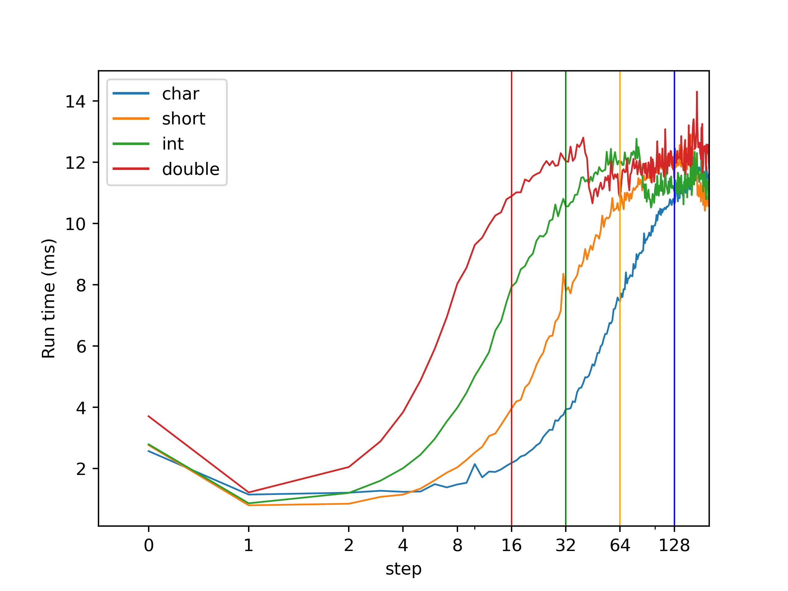
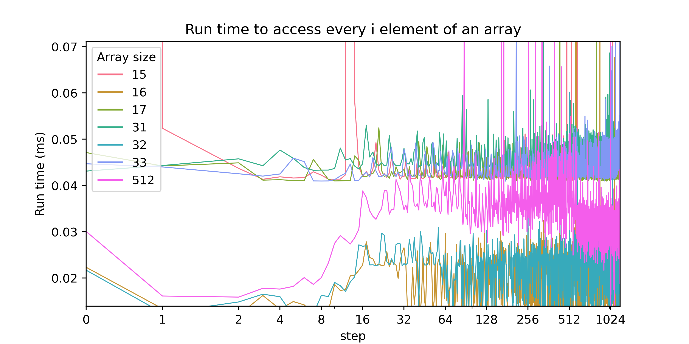

This repository is strongly inspired by:

 * [“Gallery of Processor Cache Effects“, by Igor Ostrovsky](http://igoro.com/archive/gallery-of-processor-cache-effects/)
 * [“Want fast C++? Know your hardware!“, by Timur Doumler](https://www.youtube.com/watch?v=BP6NxVxDQIs)

## On memory alignement  (padding)

In C++, a variable can not be smaller that the size of a `char` 

```cpp
{{src/m_alignement.cpp}}
```

```
{{build/m_alignement.txt}}
```

TODO m_alignement.svg


## Impact of cache lines

```cpp
constexpr std::size_t nb_elem = 513 * 1024 * 1024;
std::vector<char> vec_char(nb_elem);
for (std::size_t i = 0; i < 1024 * 1024; i++)
    vec[i * delta] += 1;
```





## L1, L2 and L3 caches

```txt
Architecture:          x86_64
CPU op-mode(s):        32-bit, 64-bit
Byte Order:            Little Endian
CPU(s):                4
On-line CPU(s) list:   0-3
Thread(s) per core:    2
Core(s) per socket:    2
NUMA node(s):          1
Vendor ID:             GenuineIntel
Model name:            Intel(R) Core(TM) i7-4510U CPU @ 2.00GHz
Stepping:              1
Virtualization:        VT-x
L1d cache:             32K
L1i cache:             32K
L2 cache:              256K
L3 cache:              4096K
```


## Cache associativity


