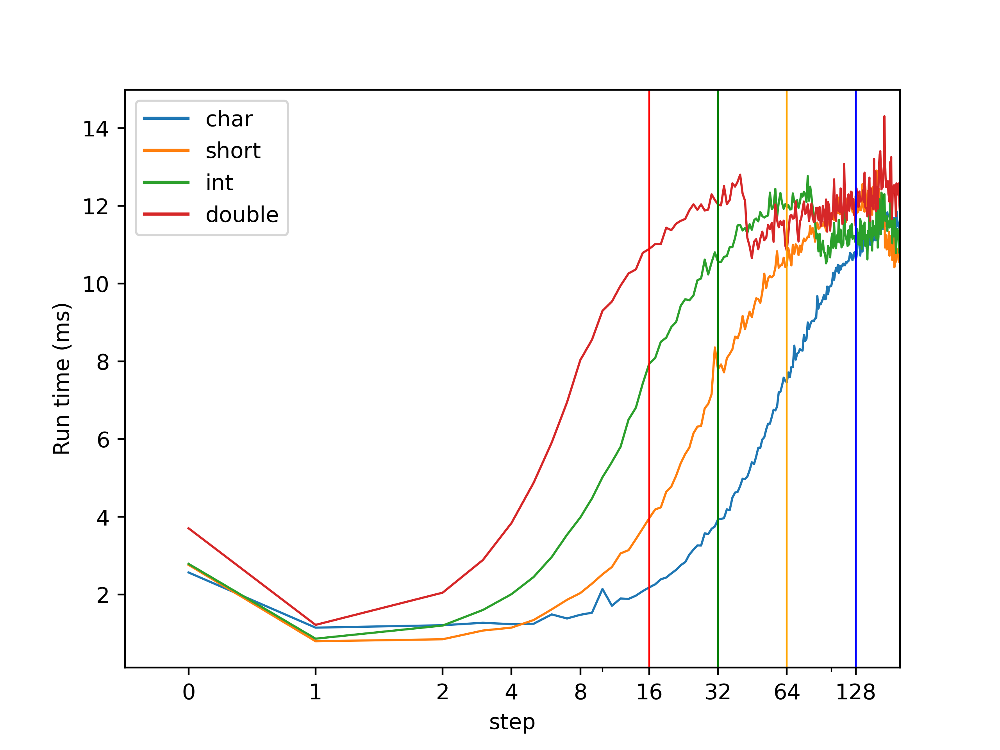

This repository is strongly inspired by:

 * [“Gallery of Processor Cache Effects“, by Igor Ostrovsky](http://igoro.com/archive/gallery-of-processor-cache-effects/)
 * [“Want fast C++? Know your hardware!“, by Timur Doumler](https://www.youtube.com/watch?v=BP6NxVxDQIs)

## On memory alignement  (padding)

In C++, a variable can not be smaller that the size of a `char` 

```cpp
#include <iostream>
#include <typeinfo>
#include <map>
#include <string>


/*! \brief Display the size and the alignement of a given type */
template <typename T> void show_size_and_alignment();

struct S_dbb  { double b; bool a; bool c; };
struct S_bdb  { bool a; double b; bool c; };
struct S_b1d  { bool b1[1]; double b; };
struct S_b8d  { bool b8[8]; double b; };
struct S_b9d  { bool b9[9]; double b; };


void show_table_header();  
template<typename T, typename... Args>  void show_sizes_and_alignments();
void show_sizes_and_alignments(){};


int main()
{
    std::cout << std::string(50,'-') << std::endl;
    show_table_header();
    show_sizes_and_alignments<bool, char, short, int, float, double>();
    
    show_table_header();
    show_sizes_and_alignments<S_bdb, S_dbb, S_b1d, S_b8d, S_b9d>();
    
    std::cout << std::string(50,'-')<< std::endl;
    return 0;
}


// Helper functions //

const char* sep = "\t| ";


const std::map<std::string, std::string> type_name = {
    {typeid(double).name(), "double"},
    {typeid(short).name(), "short"},
    {typeid(float).name(), "float"},
    {typeid(int).name(), "int"},
    {typeid(char).name(), "char"},
    {typeid(bool).name(), "bool"}};

template <typename T>
std::string get_typename() {
    const std::string key{typeid(T).name()};
    auto it = type_name.find(key);
    if(it!=type_name.end()){
        return it->second;
    }
    return key;
} 

template <typename T>
void show_size_and_alignment()
{
    const int nb_white_space = std::max<int>(0 ,8-get_typename<T>().size());
    const std::string whitespaces(nb_white_space    , ' ');
    std::cout << "  "<< get_typename<T>() << whitespaces << sep  <<sizeof(T) << " \t" <<sep  << alignof(T) << std::endl;
}


template<typename Arg, typename... Args>  
void show_sizes_and_alignments(){
    show_size_and_alignment<Arg>();
    (show_sizes_and_alignments<Args>(),...);
}


void show_table_header()
{
    std::cout << "\nTYPE\t"  << sep << "sizeof"  << sep << "alignof" << std::endl;
}

```

```
--------------------------------------------------

TYPE		| sizeof	| alignof
  bool    	| 1 		| 1
  char    	| 1 		| 1
  short   	| 2 		| 2
  int     	| 4 		| 4
  float   	| 4 		| 4
  double  	| 8 		| 8

TYPE		| sizeof	| alignof
  5S_bdb  	| 24 		| 8
  5S_dbb  	| 16 		| 8
  5S_b1d  	| 16 		| 8
  5S_b8d  	| 16 		| 8
  5S_b9d  	| 24 		| 8
--------------------------------------------------

```

TODO m_alignement.svg


## Impact of cache lines

```cpp
constexpr std::size_t nb_elem = 513 * 1024 * 1024;
std::vector<char> vec_char(nb_elem);
for (std::size_t i = 0; i < 1024 * 1024; i++)
    vec[i * delta] += 1;
```



