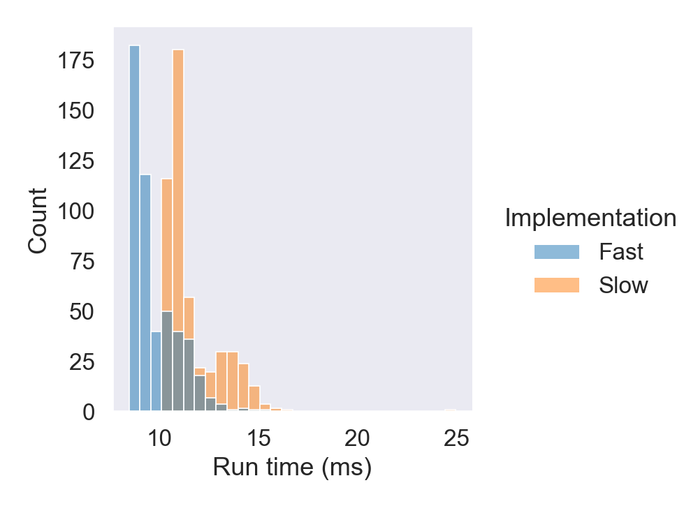

## Impact of cache lines

A cache is a smaller, faster memory, located closer to a processor core, which stores copies of the data from frequently used main memory locations. When loading data, the processor loads a whole cache line (_spatial locality_), and the data tends to remain in the cache for a few time (_temporal locality_). Accessing data that are already in a cache makes computations faster than reloading the data from the main memory. 

### Impact on linear data structure 
 
The code below accesses (a constant number of) elements separated by the distance _step_ of a vector. We can see that the run time increases with _step_ for different types and finally reaches a plateau.

For `char` for example, the performance starts to decreases after for _step > 8_. When we access 1 element, we get the 7 remaining for free as they are already loaded by the processor. For a `double` (8 bytes), the performance decreases from the start. When the data are located on independent can lines, we have a lot of _cache misses_ i.e., it is necessary to reload data from the main memory to the CPU cache. 


```cpp
{{src/f_cache_lines.hpp}}
```


### std::list versus std::vector

Cache lines thus favor linear data structure. In the above example, summing the element of a vector of int is nearly 10 times faster than using a list.


```cpp
{{src/m_cache_list_vs_vec.cpp}}
```

```cpp
{{build/m_cache_list_vs_vec.txt}}
```
Note: this is probably also linked with the absence of pointers. 

### Impact in object oriented programming - spatial locality

We can also benefit from the cache lines by locating data that are used together close in memory. 

The code example below show two similar classes but with a different layout. In that case, changing the layout enables reduces the  

```cpp
{{src/m_cache_oop_spatial.cpp}}
```

```txt
Time using the Slow class       12.2475 (ms)
Time using the Fast class       10.9222 (ms)
```



### Impact in object oriented programming - temporal locality

TODO

## To remember

 * Data are not loaded individually by the CPU but as _cache lines_.
 * Choose contiguous data structures when possible (vector > list).
 * Spatial and temporal locality impacts performance(x1.1 to x4 here).
    * changing the layout reduces cache misses.

 
 | --------------------------------- | --------------------------------- | --------------------------------- |
|:--|:--:|--:|
| [Prev page](alignement.html) | [Main page](index.html) | [Next page](l1_l2.html) |
