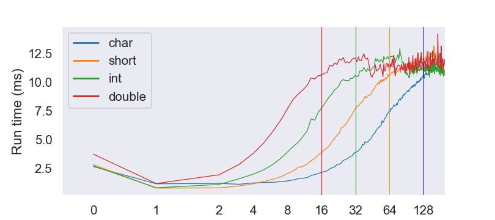

## Impact of cache lines

A cache is a smaller, faster memory, located closer to a processor core, which stores copies of the data from frequently used main memory locations. When loading data, the processor loads a whole cache line (_spatial locality_), and the data tends to remain in the cache for a few time (_temporal locality_). Accessing data that are already in a cache makes computations faster than reloading the data from the main memory. 

### Impact on linear data structure 
 
The code below accesses (a constant number of) elements separated by the distance _step_ of a vector. We can see that the run time increases with _step_ for different types and finally reaches a plateau.

For `char` for example, the performance starts to decreases after for _step > 8_. When we access 1 element, we get the 7 remaining for free as they are already loaded by the processor. For a `double` (8 bytes), the performance decreases from the start. When the data are located on independent can lines, we have a lot of _cache misses_ i.e., it is necessary to reload data from the main memory to the CPU cache. 


```cpp
#pragma once
#include <vector>
#include <assert.h>
namespace cache
{
    template <typename T>
    void touche_every_step(
        std::vector<T>& vecElem, 
        std::size_t step, 
        std::size_t nb_touch)
    {  
        assert(nb_touch*delta < vecElem.size());
        for (std::size_t i = 0; i < nb_touch; i++)
            vecElem[i * step] += 1;
    }
} // namespace cache
```



### std::list versus std::vector

Cache lines thus favor linear data structure. In the above example, summing the element of a vector of int is nearly 10 times faster than using a list.


```cpp
#include "ScopedTimer.h"
#include "DoNotOptimize.hpp"
#include <vector>
#include <list>
#include <numeric>   //std::iota
#include <algorithm> //std::accumulate
#include <iostream>

/*! \brief Prevent instruction re-ordering 
 *  \see https://stackoverflow.com/questions/37786547/enforcing-statement-order-in-c 
 */
template <class T>
__attribute__((always_inline)) inline void DoNotOptimize(const T &value) {
  asm volatile("" : "+m"(const_cast<T &>(value)));
}
constexpr std::size_t nb_elem = 1'000'000;
typedef int DataType;

int main()
{
    std::vector<DataType> vec(nb_elem);
    std::iota(vec.begin(), vec.end(), 0);

    std::list<DataType> list(nb_elem);
    std::iota(list.begin(), list.end(), 0);

    double tvec, tlist = 0;
    DataType sum_vec, sum_list = 0;
    {
        cache::ScopedTimer timer2("Time to sum the elements of a std::list:\t");
        sum_list = std::accumulate(list.begin(), list.end(), sum_list);
        cache::DoNotOptimize(sum_list);
        tlist = timer2.elapsed_ms();
    }
    {
        cache::ScopedTimer timer1("Time to sum the elements of a std::vector:\t");
        sum_vec = std::accumulate(vec.begin(), vec.end(), sum_vec);
        cache::DoNotOptimize(sum_vec);
        tvec = timer1.elapsed_ms();
    }
    std::cout <<"Ratio:\t" << tlist / tvec << std::endl;
}
```

```cpp
Time to sum the elements of a std::list:	3.52157 (ms)
Time to sum the elements of a std::vector:	0.363511 (ms)
Ratio:	9.48488

```
Note: this is probably also linked with the absence of pointers. 

### Impact in object oriented programming - spatial locality

We can also benefit from the cache lines by locating data that are used together close in memory. 

The code example below show two similar classes but with a different layout. In that case, changing the layout enables reduces the  

```cpp
#include "ScopedTimer.h"
#include <vector>
#include <list>
#include <numeric>   //std::iota
#include <algorithm> //std::accumulate
#include <iostream>

class Slow {
public:            double compute() const { return d2 * d9 + d5 * d4; }
private:
    double d2 = 2;
    double darray1[128];
    double d9 = 9;
    double d4 = 4;
    double darray2[128];
    double d5 = 5;
};

class Fast {
public:         double compute() const { return d2 * d9 + d5 * d4; }
private:
    double darray1[128];    double darray2[128];
    double d2 = 2;          double d9 = 9;
    double d4 = 4;          double d5 = 5;
};

int main()
{
    constexpr std::size_t nb_elem = 500'000;
    constexpr std::size_t repeat = 500;

    std::vector<Fast> vecFast(nb_elem);
    std::vector<Slow> vecSlow(nb_elem);
    auto lambda_acc = [](double a, const auto &b) { return a + b.compute(); };

    double sum_slow = 0;
    for (std::size_t i = 0 ; i < repeat; ++i){
        cache::ScopedTimer timer1("Time using the Slow class\t");
        sum_slow = std::accumulate(vecSlow.begin(), vecSlow.end(), 0, lambda_acc);
    }
    
    double sum_fast = 0;
    for (std::size_t i = 0 ; i < repeat; ++i){
        cache::ScopedTimer timer1("Time using the Fast class\t");
        sum_fast = std::accumulate(vecFast.begin(), vecFast.end(), 0, lambda_acc);
    }
    std::cout << sum_slow << " " << sum_fast << " " << Fast().compute() << std::endl;
}
```

```txt
Time using the Slow class       12.2475 (ms)
Time using the Fast class       10.9222 (ms)
```


### Impact in object oriented programming - temporal locality

TODO

## To remember

 * Data are not loaded individually by the CPU but as _cache lines_.
 * Choose contiguous data structures when possible (vector > list).
 * Spatial and temporal locality impacts performance(x1.1 to x4 here).
    * changing the layout reduces cache misses.

 
 | --------------------------------- | --------------------------------- | --------------------------------- |
|:--|:--:|--:|
| [Prev page](todo.html) | [Main page](index.html) | [Next page](todo.html) |
